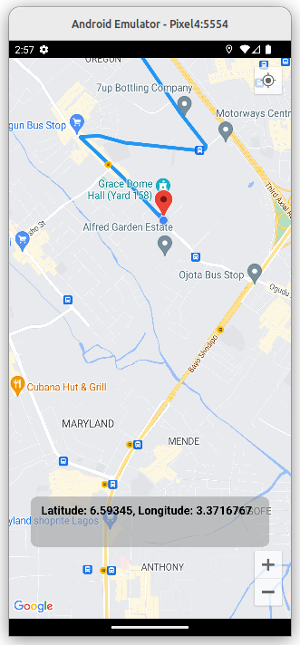

# google_map_flutter

An example project that shows how to implement google map in flutter using current location and more...

## Screenshots
<table>
  <tr>
    <td></td>
  </tr>
 </table>
 
### Todo
- [x] Live location
- [x] Search places 
- [x] Get two points
- [ ] Real time tracking
- [ ] Select dark/light mode

### To run the application
- Clone the repo
- Get an API key at https://cloud.google.com/maps-platform/ and enable Google Map SDK for each platform(android, ios, web)
- Add API keys to credentials file and android/app/src/main/AndroidManifest.xml inside Application tag 
  ```
  ...
  <meta-data 
      android:name="com.google.android.geo.API_KEY"
      android:value="API_KEY_HERE"
  />
  ...
  ```
- Run `flutter pub get` or `dart pub get` to download all dependencies listed in the pubspec.yaml file
- run `flutter run` to compile the project

